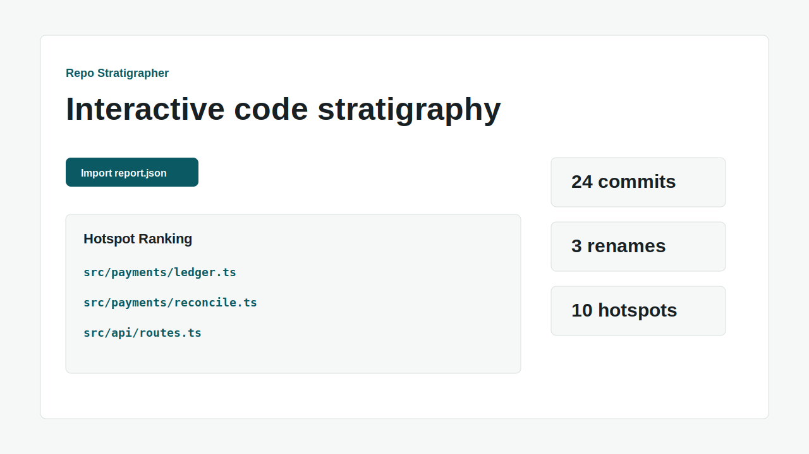

# Repo Stratigrapher

Repo Stratigrapher 会把 Git 历史、目录演化、测试失败和热点文件叠成可交互的代码地层图，帮助维护者、顾问和新贡献者在修改旧仓库前先理解仓库如何演化。



## 核心价值

- 使用真实提交统计计算热点文件，而不是固定样例数据。
- 用时间轴回放目录树，展示结构和重命名的演化。
- 导出 Markdown 和 JSON 报告，并给出新贡献者阅读路线。

## 快速开始

```bash
npm ci
npm run fixture
node bin/repo-stratigrapher.mjs analyze --repo examples/fixture-repo --out dist-demo
npm run dev
```

打开本地 Web 应用后导入 `dist-demo/report.json`，也可以直接查看 `dist-demo/report.md`。

## 功能

- 通过 `simple-git` 导入本地 Git 仓库
- 解析提交、作者、路径、重命名和行数变化
- 计算热点、脆弱度、最近活跃度和变更耦合
- 生成目录树时间轴快照
- 使用 D3 展示 treemap
- 导出 Markdown 和 JSON 报告
- 使用 SQL.js 序列化本地缓存
- 默认掩码提交邮箱，并提供常见 Token 形态脱敏

## 示例数据

`scripts/generate_fixture_repo.mjs` 会在本地生成 `examples/fixture-repo/`。该合成仓库包含 20 次以上提交、3 次重命名、热点模块和测试失败记录。fixture 目录被 `.gitignore` 忽略，避免把嵌套 Git 历史上传为项目历史。

## 验证命令

```bash
npm run lint
npm run format
npm run typecheck
npm run test:coverage
npm run test:e2e
npm run build
npm run package
make verify
make demo
make package
make release-check
```

## 隐私边界

项目默认本地运行，不上传私有仓库内容。生成报告默认掩码邮箱，GitHub Pages 演示只使用合成数据。更多说明见 [docs/PRIVACY_AND_SECURITY.md](docs/PRIVACY_AND_SECURITY.md)。

## 许可证

MIT，见 [LICENSE](LICENSE)。
